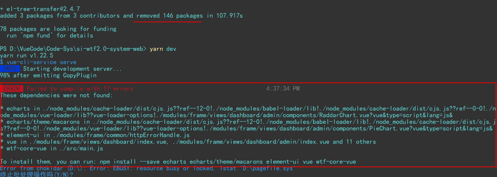

npm安装依赖报错问题汇总：

### 1. 安装一个依赖包，
安装成功一个依赖包之后，提示remove掉好几十个依赖包，项目启动报错。

如图所示：
    成功是成功了，就是给我增加了3个package，同时remove了146个package，这情何以堪！
我也不知道为啥用下边的这个命令。
```bash
npm  instll el-tree-transfer --ignore-scripts
```
反正这么操作之后，项目未报错。也不会给我移除一百多个package。